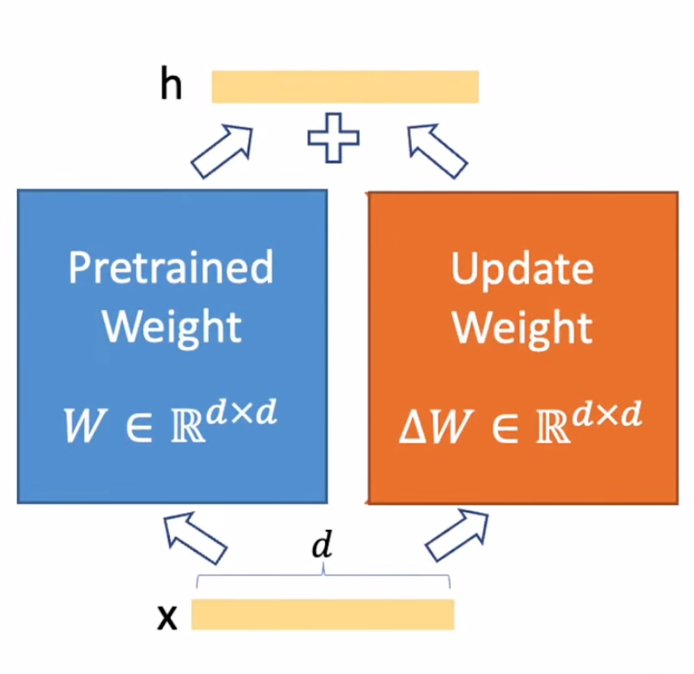
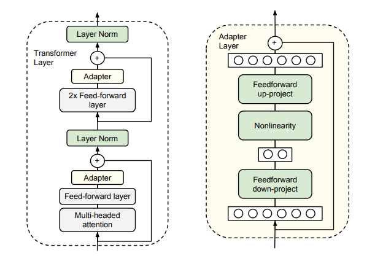
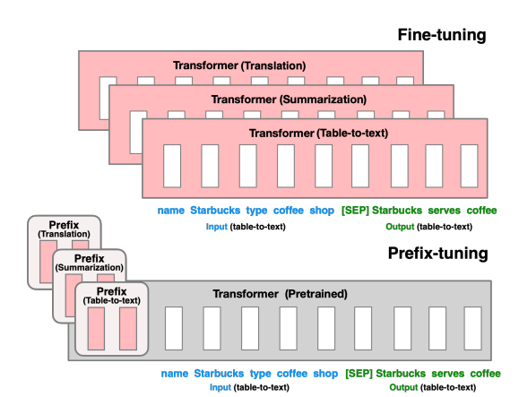
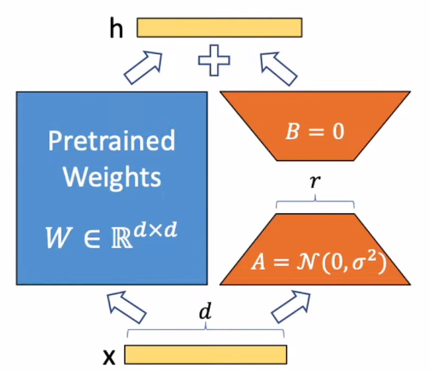
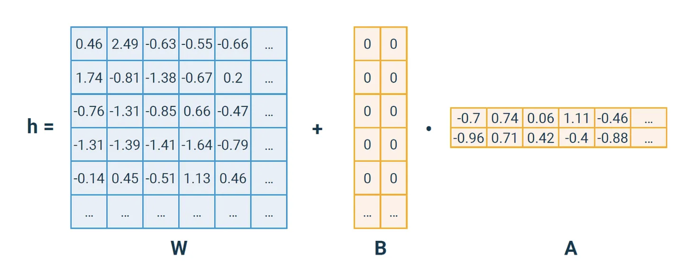
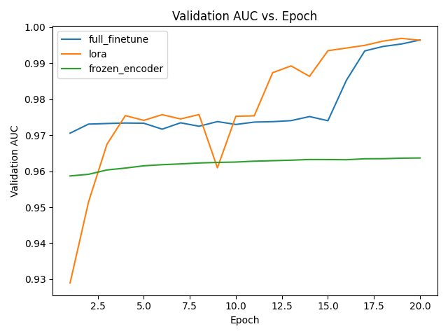
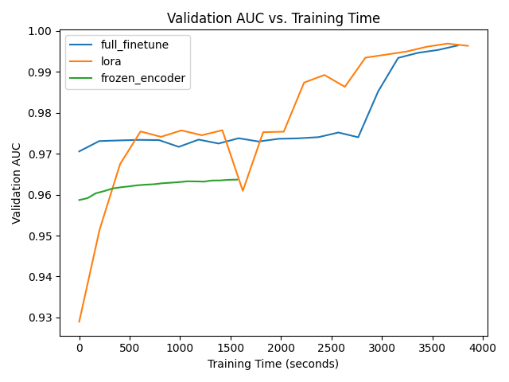

# LoRA: Low-Rank Adaptation of Large Language Models

## Introduction
- Adapting large language models to downstream tasks is useful but challenging
  - Fine-tuning is expensive and resource-intensive
  - Models like GPT-3 (175B parameters) require significant resources
- Existing parameter-efficient adaptation techniques have limitations
  - Adapter layers increase inference latency
  - Prompt-based methods reduce available sequence length
- LoRA: Low-Rank Adaptation of Large Language Models (Hu et al., 2021)
  - Efficient adaptation technique
  - Adds low-rank update matrices to pre-trained weights
  - Reduces trainable parameters while maintaining performance
- This repo provides an overview of LoRA and demonstrates its implementation in PyTorch


## Background
### Fine-Tuning and Parameter-Efficient Adaptation
- Traditional Fine-Tuning
  - Update all model parameters during adaptation
  - Requires storing a separate copy of the model for each downstream task
  - Expensive for large models like GPT-3

<p align="center">
  <br>
  <em>Figure: Fine-tuning a pre-trained model for a downstream task.</em>
</p>

- Parameter-Efficient Adaptation Techniques
  - Adapter Layers (Houlsby et al. 2019) (Lin et al. 2020)
    - Insert additional layers between pre-trained weights
    - Capture task-specific information
    - Increase inference latency due to additional computations
  - Prompt-Based Methods (Li and Liang 2021)
    - Optimize continuous prompts to steer model's behavior
    - Do not modify model weights
    - Reduce available sequence length for input tokens
  - Limitations of Existing Techniques
    - Increased inference latency (Adapter Layers)
    - Reduced sequence length (Prompt-Based Methods)
    - Need for more efficient adaptation methods

<p align="center">
  <table>
    <tr>
      <td></td>
      <td></td>
    </tr>
  </table>
  <em>Figure: Adapter Layers and Prompt-Based Methods.</em>

## LoRA: Low-Rank Adaptation

<p align="center">
  <br>
  <em>Figure: Low-Rank Adaptation.</em>
</p>

### Breakdown steps of LoRA:
- Initial Weight Matrix: $W_0 \in \mathbb{R}^{d \times k}$ 
- Update to the weight matrix: $\Delta W$ is represented as the product of two matrices $B \in \mathbb{R}^{d \times r}, A \in \mathbb{R}^{r \times k}$
- Low-Rank Constraint: The rank r is much smaller than both $d$ and $k$, where $r \ll \min(d, k)$
- Applying Update: adding low-rank update matrices to the pre-trained weights $W_0 + \Delta W = W_0 + BA$
- Compute the Final output: $h = W_0x + \Delta Wx = W_0x + BAx$

Here is how lora looks like for an actual matrix:


During the LoRa initilization, the paper use a random Gaussian initialization for A and zero for B, so $\Delta W = BA$ is zero at the beginning of training. 

And then scale $\Delta Wx$ by $\frac{\alpha}{r}$, where $\alpha$ is a constant in $\mathbb{R}$. 

When optimizing with Adam, $\alpha$ is set to the first ${r}$ and do not tune it. This scaling helps to reduce the need to retune hyperparameters when vary ${r}$.

### Advantages of LoRA
- Parameter Efficiency: Achieves comparable performance to fine-tuning with fewer trainable parameters
- Reduced Storage and Deployment Costs: Stores only small low-rank update matrices for each task, instead of full model copies
- Efficient Task Switching: Enables quick switching between tasks by swapping LoRA matrices
- Reduced Training and Inference Latency: Optimizes only low-rank matrices during training and merges them with pre-trained weights for inference
- Compatibility: Can be combined with other adaptation methods like prefix-tuning or adapter layers


### Formal pseudocode for LoRA
- **Input:**
  - Pre-trained weight matrix: $W_0 \in \mathbb{R}^{d \times k}$
  - Input vector: $x \in \mathbb{R}^d$
- **Output:**
  - Updated output vector: $h \in \mathbb{R}^k$
- **Hyperparameters:**
  - Rank: $r \in \mathbb{N}, r \ll \min(d, k)$
  - Scaling factor: $\alpha \in \mathbb{R}$
- **Parameters:**
  - Low-rank matrices: $A \in \mathbb{R}^{r \times k}, B \in \mathbb{R}^{d \times r}$

1. Initialize update matrix: $\Delta W \gets 0_{d \times k}$
2. For $i = 1$ to $r$:
   - For $j = 1$ to $k$:
     - Update $\Delta W_{:, j} \gets \Delta W_{:, j} + B_{:, i} \cdot A_{i, j}$
3. Update weight matrix: $W \gets W_0 + \frac{\alpha}{r}\Delta W$
4. Compute final output: $h \gets W \cdot x$
5. **Return** updated output vector $h$


## Code Demo and Results
### Experimental Setup
- Dataset: Gravitation Wave Detection (GW) Dataset
  - Binary classification task
  - Detecting gravitational wave signals from noise
  - 1,000 training samples and 1,000 validation samples
- Model: Whisper Encoder(Transformer-based model) + Classification Head
- Adaptation Techniques Compared:
  - Full Fine-Tuning
  - Freeze Encoder Part of Model
  - LoRA
- Evaluation Metrics: Classification AUC

### Implementation Details
- Step to implementation of LoRA from scratch in PyTorch
  - Use `torch.nn.Parameter` to define low-rank update matrices A and B
  - Implement LoRA linear layer with low-rank update in the forward pass
  - Replace the original linear layer in the Whisper model with LoRA layer

- Code Snippet for Implementing LoRA Layer
  - See full code in the accompanying Jupyter notebook and src folder

```python
# Core implementation of LoRA layer
class LoRA_layer(torch.nn.Module):
    def __init__(self, in_dim, out_dim, rank, alpha):
        super().__init__()
        self.A = torch.nn.Parameter(torch.randn(in_dim, rank))
        self.B = torch.nn.Parameter(torch.zeros(rank, out_dim))
        self.alpha = alpha
        self.rank = rank

    def forward(self, x):
        x = self.alpha / self.rank * (x @ self.A @ self.B) # @ is matrix multiplication
        return x

class LoRa_linear(torch.nn.Module):
    def __init__(self, linear, rank, alpha):
        super().__init__()
        self.linear = linear
        self.lora = LoRA_layer(linear.in_features, linear.out_features, rank, alpha)

    def forward(self, x):
        return self.linear(x) + self.lora(x)

# Replace the original linear layer with LoRA layer
for layer in model.encoder.blocks:
    if args.lora_q:
        layer.attn.query = replace_lora(layer.attn.query)
    if args.lora_k:
        layer.attn.key = replace_lora(layer.attn.key)
    if args.lora_v:
        layer.attn.value = replace_lora(layer.attn.value)
```

When we print the model, the attention layer looks like this:
```
....
(blocks): ModuleList(
      (0-11): 12 x ResidualAttentionBlock(
        (attn): MultiHeadAttention(
          (query): Linear(in_features=768, out_features=768, bias=True)
          (key): Linear(in_features=768, out_features=768, bias=False)
          (value): Linear(in_features=768, out_features=768, bias=True)
          (out): Linear(in_features=768, out_features=768, bias=True)
        )
....
```

Once the LoRA layer is replaced, the `print(model)` will show the LoRA layer in the model like this:
```
....
(blocks): ModuleList(
  (0-11): 12 x ResidualAttentionBlock(
    (attn): MultiHeadAttention(
      (query): LoRa_linear(
        (linear): Linear(in_features=768, out_features=768, bias=True)
        (lora): LoRA_layer()
      )
....
```


### Results and Analysis

Compare the trainable parameters
- Full Fine-Tuning (**89M** parameters)
- Freeze Encoder Part of Model (**2.32M** parameters)
- LoRA (**3.4M** parameters at r = 8)

VRam usage of the three models:
- Full Fine-Tuning (**8.5GB**)
- Freeze Encoder Part of Model (**2.2GB**)
- LoRA (**6.1GB** at r = 8)

Results of the three adaptation techniques in 20 epochs
- full_finetune best val_auc: 0.9964, best val_loss: 0.071
- lora best val_auc: 0.9968, best val_loss: 0.060
- frozen_encoder best val_auc: 0.9636, best val_loss: 0.232

<p align="center">
  <table>
    <tr>
      <td></td>
      <td></td>
    </tr>
  </table>
  <em>Figure: Left - Validation AUC vs Epochs, Right - Validation Auc vs Training Time. </em>
</p>


- Further observations
  - LoRA achieves similar performance to full fine-tuning with fewer parameters
  - Both LoRA and full fine-tuning outperforms the model with frozen encoder
  - LoRA reduces trainable parameters and VRam usage, but did not reduce the training time 

## Conclusion
- LoRA is an efficient and effective adaptation technique for large language models
  - Reduces trainable parameters and maintains performance
  - Enables quick task-switching and efficient deployment
- Low-rank structure provides insights into adaptation process
  - Task-specific directions are amplified with low-rank updates
- LoRA opens up new possibilities for efficient adaptation of large models

## References

Neil Houlsby, Andrei Giurgiu, Stanislaw Jastrzebski, Bruna Morrone, Quentin de Laroussilhe, Andrea Gesmundo, Mona Attariyan, and Sylvain Gelly. Parameter-Efficient Transfer Learning for NLP. arXiv:1902.00751 [cs, stat], June 2019. URL http://arxiv.org/abs/1902.00751.

Greg Yang and Edward J. Hu. Feature Learning in Infinite-Width Neural Networks.arXiv:2011.14522 [cond-mat], May 2021. URL http://arxiv.org/abs/2011.14522. arXiv: 2011.14522.

Xiang Lisa Li and Percy Liang. Prefix-Tuning: Optimizing Continuous Prompts for Generation.
arXiv:2101.00190 [cs], January 2021. URL http://arxiv.org/abs/2101.00190.


## Appendix
- Jupyter Notebook: [lora_example.ipynb](lora_example.ipynb)
- To run the training pipeline, use the following command:
  ```bash
  python src/train.py --model lora --rank 8 --alpha 8
  ```